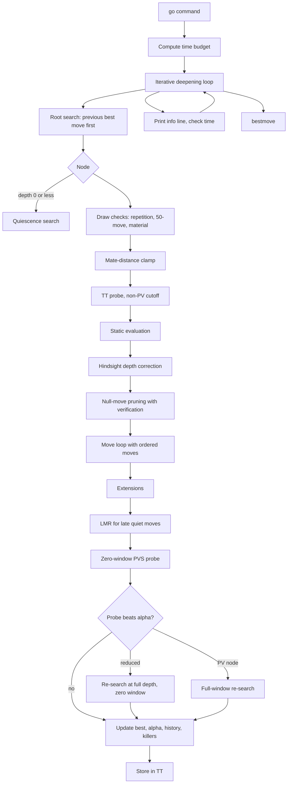

<div align="center">

# ♟️ ZERO

### A UCI chess engine with a handcrafted evaluation, built from scratch in C++17


**Goal:** reach 2700–2800 Elo with a pure handcrafted evaluation (HCE), then add NNUE on top.

</div>

---

## 📖 Table of contents

- [At a glance](#-at-a-glance)
- [Strength and results](#-strength-and-results)
- [Quick start](#-quick-start)
- [Features](#-features)
- [Search pipeline](#-search-pipeline)
- [UCI options](#-uci-options)
- [Testing and validation](#-testing-and-validation)
- [Tuning and match tooling](#-tuning-and-match-tooling)
- [Roadmap](#-roadmap)
- [Repository layout](#-repository-layout)
- [Documentation index](#-documentation-index)
- [Provenance and independence](#-provenance-and-independence)
- [Known limitations](#-known-limitations)
- [Author and license](#-author-and-license)

---

## ✨ At a glance

| | |
|---|---|
| **Engine name** | ZERO 2.6 R3.4 Clean |
| **Author** | Rohan Singh |
| **Language** | C++17 (no external dependencies) |
| **Protocol** | UCI: works with Cute Chess, Arena, Lucas Chess and similar GUIs |
| **Board** | 64-bit bitboards (A1 = bit 0) plus a 64-square piece lookup |
| **Search** | Iterative-deepening principal-variation search with a transposition table |
| **Evaluation** | Handcrafted: material, piece-square tables, mobility, pawn structure, king safety, threats |
| **Threads** | Single-threaded (multi-threading is planned) |
| **Next milestone** | Speed phase, then pruning stack, then tapered and tuned evaluation |

---

## 📊 Strength and results

> **How to read these numbers:** every figure below comes from a specific test setup,
> listed next to it. Elo values are relative to that setup, not absolute ratings.

### Rating of the previous generation (R3.3)

| Measurement | Result |
|---|---|
| Stockfish `UCI_LimitStrength` / `UCI_Elo` calibration | **≈ 2270** |

This figure is relative: it depends on the Stockfish version, time control, hash and
hardware used. R3.4 has not been re-measured on the same scale yet.

### R3.4 Clean vs R3.3 (self-play)

| Setting | Value |
|---|---|
| Games | 500, colours swapped, balanced 8-ply openings |
| Time control | 10 s + 0.1 s |
| Hash / threads | 16 MB / 1 per engine |
| Opening suite | `tuning/zero_openings_8ply.epd` |
| Adjudication | none |

| Result | Value |
|---|---|
| Wins / draws / losses (R3.4's view) | **299 / 122 / 79** |
| Score | **72.0 %** |
| Elo difference | **+164 ± 28** (self-play) |
| Likelihood of superiority | 100 % |
| White vs Black over all games | 48.4 % (no colour bias) |

**Reading it honestly**

- 89 of R3.4's wins came from the old build losing on time (it overshot its time
  budget). Excluding those games, R3.4 scored about **66 %**, roughly **+115 Elo**,
  which is the better estimate of the pure search and bug-fix gain.
- Self-play gains tend to overstate gains against *other* engines.
- Results are for 10 s + 0.1 s only. A longer-time-control confirmation is planned.

---

## 🚀 Quick start

### Build with CMake

```bash
git clone <your-repository-url> zero
cd zero
cmake -S . -B build -DCMAKE_BUILD_TYPE=Release
cmake --build build -j
```

If you do not set a build type, **Release** is used.

On Windows with the Visual Studio generator, the configuration is chosen at build time
(see [`BUILD_WINDOWS.md`](BUILD_WINDOWS.md)):

```powershell
cmake -S . -B build -DBUILD_TESTING=ON
cmake --build build --config Release -j 4
ctest --test-dir build -C Release --output-on-failure
```

### Build with a single command (g++ / clang++)

```bash
g++ -std=c++17 -O3 -DNDEBUG -Isrc src/*.cpp src/evaluation/*.cpp -o zero
```

### Use it in a GUI

Add the executable as a **UCI engine**. For bullet play, set `Move Overhead` to
50–100 ms to cover GUI latency.

### Talk to it directly

```text
uci
isready
position startpos moves e2e4 e7e5
go movetime 2000
```

```text
info depth 10 seldepth 25 score cp 10 time 1135 nodes 705730 nps 621788 hashfull 66 pv c2c4
bestmove c2c4
```

Supported `go` limits: `wtime`, `btime`, `winc`, `binc`, `movestogo`, `movetime`, `depth`.
Mate scores are reported as `score mate N`.

---

## 🧠 Features

### Board and move generation

- 64-bit bitboards with per-piece, per-colour and per-type boards.
- Precomputed attack masks for pawns, knights and kings; occupancy-aware rays for sliders.
- Zobrist hashing, make/undo, castling and en-passant state kept in `StateInfo`.
- Legal move generation with a make/undo legality filter.
- Validated by perft on the standard test positions (see [Testing](#-testing-and-validation)).

### Search

| Technique | Notes |
|---|---|
| Iterative deepening + PVS | Zero-window probes with re-search on fail-high; correct PV / cut / all node typing |
| Transposition table | 16-byte entries, default 16 MB, generation aging, mate-score adjustment |
| Null-move pruning | Eval-gated, depth-scaled reduction, verification search at depth |
| Late-move reductions | Precomputed log-based table plus corrections for PV, cut nodes, TT move, history and improving |
| Mate-distance pruning | Clamps the window by the distance to mate |
| Extensions | Check and promotion, rationed by ply so chains cannot blow up the tree |
| Quiescence search | Captures, promotions and (for now) quiet checks; evasions when in check |
| Move ordering | TT move, captures (victim/attacker value plus capture history), counter-move, two killers, quiet history |
| History heuristics | Butterfly history, 1-ply continuation history, capture history |
| Hindsight depth correction | Adjusts depth when a reduced move turns out better or worse than expected |
| Draw detection | In-tree repetition, fifty-move rule, insufficient material |
| Partial-iteration results | If time runs out mid-iteration, a finished best move is still used |

### Evaluation (handcrafted)

- **Material** and **piece-square tables**
- **Mobility** for knights, bishops, rooks and queens
- **Pawn structure:** passed, isolated and doubled pawns
- **King safety**, scaled by game phase
- **Threats** analysis

### Time management

- Clock-based allocation with increment, a safety reserve and a configurable `Move Overhead`.
- Uses best-move and score stability between iterations when deciding whether to continue.
- A hard cap, so an increment larger than the remaining clock cannot cause a flag.

---

## 🔍 Search pipeline



---

## ⚙️ UCI options

All search constants are exposed as options, so they can be tuned with SPSA or checked in
SPRT without recompiling.

### General

| Option | Default | Range | Purpose |
|---|---|---|---|
| `Hash` | 16 | 1–4096 | Transposition table size in MB |
| `Move Overhead` | 20 | 0–2000 | Time reserved per move for GUI/IO latency (ms) |

### Null-move pruning

| Option | Default | Range |
|---|---|---|
| `NMPMinDepth` | 4 | 3–12 |
| `NMPMarginBase` | 110 | −200–600 |
| `NMPMarginPerDepth` | 10 | 0–40 |
| `NMPReductionBase` | 3 | 1–6 |
| `NMPDepthDivisor` | 4 | 2–8 |
| `NMPEvalDivisor` | 300 | 64–800 |
| `NMPEvalCap` | 3 | 0–6 |
| `NMPVerifyDepth` | 10 | 6–30 |
| `NMPVerifyPercent` | 65 | 25–100 |

### Hindsight depth correction

| Option | Default | Range |
|---|---|---|
| `HindsightRecoverReduction` | 3 | 2–8 |
| `HindsightTrimReduction` | 2 | 1–6 |
| `HindsightTrimEvalSum` | 150 | 0–600 |

### Extensions and history

| Option | Default | Range |
|---|---|---|
| `CheckExtension` | 1 | 0–1 |
| `PromotionExtension` | 1 | 0–1 |
| `ExtensionPlyLimitPct` | 200 | 100–400 |
| `HistoryBonusPerDepth` | 110 | 8–400 |
| `HistoryBonusMax` | 1400 | 200–4000 |
| `HistoryMalusPercent` | 60 | 0–150 |

### Late-move reductions (1/1024-ply units)

| Option | Default | Range |
|---|---|---|
| `LMRBase` | 820 | −4096–4096 |
| `LMRLogScale` | 470 | 0–1200 |
| `LMRDepthCoeff` | 0 | −2048–2048 |
| `LMRMoveCoeff` | 0 | −2048–2048 |
| `LMRPVAdjust` | −512 | −2048–2048 |
| `LMRCutAdjust` | 512 | −2048–2048 |
| `LMRTTAdjust` | −1024 | −4096–1024 |
| `LMRHistoryCoeff` | −80 | −1024–1024 |
| `LMRContinuationCoeff` | 0 | −1024–1024 |
| `LMRImprovingAdjust` | −256 | −2048–1024 |
| `LMRTacticalSafetyAdjust` | 0 | −2048–1024 |

> Defaults are neutral starting points, not final tuned values.
> See [`docs/PARAMETER_PROVENANCE.md`](docs/PARAMETER_PROVENANCE.md).

---

## ✅ Testing and validation

### Perft (move generation)

| Position | Depth | Nodes |
|---|---|---|
| Start position | 5 | 4,865,609 |
| Kiwipete | 4 | 4,085,603 |
| Position 3 | 4 | 43,238 |
| Position 4 | 3 | 9,467 |
| Position 5 | 3 | 62,379 |
| Position 6 | 3 | 89,890 |

### Unit and integration tests

| Test | What it covers |
|---|---|
| `perft_test` | Move-generation correctness |
| `position_integrity_test` | Randomised make/undo integrity |
| `search_smoke_test` | End-to-end search sanity |
| `repetition_search_test` | Repetition counting, in-tree repetition, insufficient material, fifty-move rule |
| `search_time_test` | Time budgets, increment cap, move overhead, no-clock behaviour |
| `mistake_punisher_test` | Hindsight depth correction rules |

```bash
cmake -S . -B build -DBUILD_TESTING=ON
cmake --build build -j
ctest --test-dir build --output-on-failure
```

---

## 🎛️ Tuning and match tooling

All tools live in [`tuning/`](tuning).

| Tool | Purpose |
|---|---|
| `ab_match.py` | Small A/B match runner (Python standard library only); scores checkmate and stalemate correctly |
| `tools/genbook.cpp` | Generates an eval-balanced opening suite (random 8-ply lines filtered by search) |
| `zero_openings_8ply.epd` | 400 unique balanced openings, ready for Cute Chess / `cutechess-cli` |
| `spsa_lmr.py`, `spsa_lmr_phase1.py` | SPSA harness for LMR parameters |
| `holdout.fen`, `regression.fen` | Held-out and regression positions |

### Recommended match setup (cutechess-cli)

```bash
cutechess-cli \
  -engine name=New cmd=zero_new proto=uci option.Hash=16 "option.Move Overhead=50" \
  -engine name=Old cmd=zero_old proto=uci option.Hash=16 \
  -each tc=10+0.1 \
  -openings file=tuning/zero_openings_8ply.epd format=epd order=random \
  -games 2 -rounds 200 -repeat -concurrency 4 \
  -pgnout match.pgn
```

Add `-sprt elo0=0 elo1=10 alpha=0.05 beta=0.05` for an early-stopping test. Keep
adjudication off, use one thread per engine, and give both engines the same hash.

> Before R3.4 the SPSA harness mis-scored checkmates as draws. Re-run earlier tuning on
> current builds. Details are in [`CHANGELOG_R3.4_CLEANUP.md`](CHANGELOG_R3.4_CLEANUP.md).

---

## 🗺️ Roadmap

Each change must beat the frozen previous build on the same suite before it is merged.

**Phase A: speed**
- [ ] Qsearch rewrite: no per-node quiet checks, TT probe, delta/SEE pruning
- [ ] Pseudo-legal move generation with a pin-aware legality check
- [ ] Staged move picker with SEE, losing captures last
- [ ] Evaluation cache, pawn hash, static eval stored in the TT

**Phase B: pruning**
- [ ] Reverse futility and futility pruning
- [ ] Late-move pruning
- [ ] SEE pruning
- [ ] Razoring and internal iterative reduction
- [ ] ProbCut

**Phase C: evaluation**
- [ ] Tapered middlegame/endgame piece-square tables
- [ ] Endgame king table, stronger passed pawns
- [ ] Draw scaling for known drawish endings
- [ ] Texel tuning on quiet positions from match PGNs

**Phase D: search refinement**
- [ ] Aspiration windows
- [ ] Singular extensions
- [ ] More continuation-history plies, correction history
- [ ] Smarter time management

**Later**
- [ ] Multi-threaded search with UCI `stop` and `ponder`
- [ ] NNUE evaluation on top of the HCE baseline

---

## 📁 Repository layout

```text
zero/
├── CMakeLists.txt
├── README.md
├── CHANGELOG_R3.4_CLEANUP.md
├── src/
│   ├── main.cpp, uci.cpp/.h            UCI loop and option handling
│   ├── position.cpp/.h, bitboard.*     board state, bitboards, make/undo
│   ├── movegen.*, move.h               move generation
│   ├── movepick.*                      move ordering
│   ├── search.cpp/.h                   main search
│   ├── search_root.cpp                 iterative deepening, root search, stop logic
│   ├── search_params.h                 tunable search parameters
│   ├── search_helpers.*, search_stack.h, search_types.h
│   ├── search_mistake.*                hindsight depth correction
│   ├── search_time.*                   time management
│   ├── qsearch.*                       quiescence search
│   ├── repetition.*                    draw and repetition rules
│   ├── history.*, killer.*, countermove.*
│   ├── tt.*                            transposition table
│   ├── zobrist.*, thread.*, types.h
│   ├── evaluation.cpp, pst.*           evaluation entry point, piece-square tables
│   └── evaluation/                     material, mobility, pawns, king, threats
├── tests/                              unit and integration tests
├── tuning/                             match runner, SPSA, opening suite, tools
├── docs/                               architecture, provenance, validation, history
└── reference/                          reference notes
```

---

## 📚 Documentation index

| Document | Contents |
|---|---|
| [`CHANGELOG_R3.4_CLEANUP.md`](CHANGELOG_R3.4_CLEANUP.md) | Every bug fix and change in R3.4 |
| [`docs/PARAMETER_PROVENANCE.md`](docs/PARAMETER_PROVENANCE.md) | Where each search constant comes from and how it was changed |
| [`docs/ARCHITECTURE.md`](docs/ARCHITECTURE.md) | Module layout |
| [`docs/MISTAKE_PUNISHER.md`](docs/MISTAKE_PUNISHER.md) | Hindsight depth correction |
| [`docs/HISTORY.md`](docs/HISTORY.md) | Earlier milestones: bitboard migration, killer moves, SPSA harness |
| [`R3_INDUSTRIAL_AUDIT.md`](R3_INDUSTRIAL_AUDIT.md), [`R3.2_LMR_NMP.md`](R3.2_LMR_NMP.md), [`R3.3_SPSA_LMR.md`](R3.3_SPSA_LMR.md) | Earlier search and tuning notes. Some predate R3.4; see the changelog for what changed |
| [`BUILD.md`](BUILD.md), [`BUILD_WINDOWS.md`](BUILD_WINDOWS.md) | Build instructions |

---

## 🧬 Provenance and independence

ZERO is being developed as an independent engine. Early versions were architecturally
inspired by other open-source engines, and R3.4 began replacing that inheritance:

- Search constants that matched another engine were replaced with **ZERO-owned, tunable**
  parameters that have neutral defaults.
- Each constant, its old value and its new value are recorded in
  [`docs/PARAMETER_PROVENANCE.md`](docs/PARAMETER_PROVENANCE.md).
- New features are written from published technique descriptions and logged there with
  author and date.
- Stockfish is used as a **test opponent and calibration reference**, not as a code source.

The structural clean-up is ongoing. The roadmap and the provenance log show what is still
to be re-derived.

---

## ⚠️ Known limitations

- Move generation filters legality with make/undo, and quiescence search still generates
  quiet checks at every node. This is slower than it should be, especially in check-heavy positions.
- No futility, late-move, SEE or razoring pruning yet, and no aspiration windows.
- Evaluation is not tapered, so the king table is middlegame-only.
- UCI runs on a single thread: `stop`, `ponder` and an unbounded `go infinite` are not supported.
- Elo figures come from self-play and a Stockfish-calibrated scale, not from a public rating list.

---

## 👤 Author and license

**Author:** Rohan Singh

**License:** *not yet chosen*. Add a `LICENSE` file before publishing widely
(MIT, Apache-2.0 and GPL-3.0 are the usual choices for chess engines).

**Acknowledgements:** the [Chess Programming Wiki](https://www.chessprogramming.org/),
[Cute Chess](https://cutechess.com/), and the wider computer-chess community.

---

<div align="center">

*ZERO: built from zero.*

</div>
